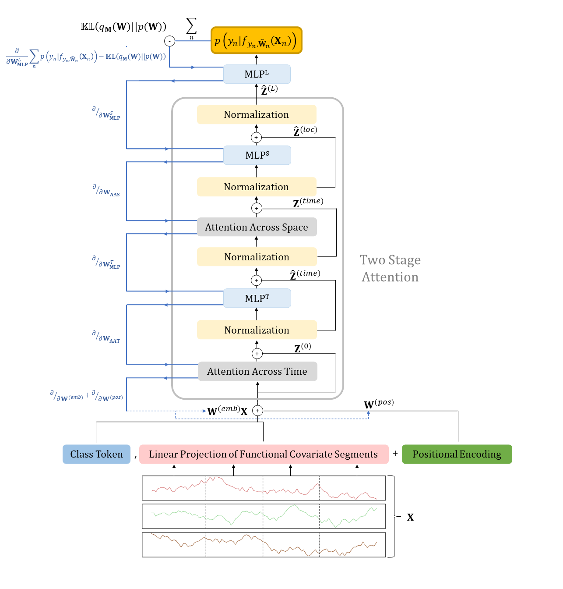

# Likelihood-guided-regularization-in-transformers

This repository contains an implementation of a new, Ising prior type regularization for transformers. This is part of an upcoming paper. 

## Key Points of implementation

**1. Regularization via Ising prior**

<p align="center">
  
  <br>
  <b>Figure 1.</b> Model Architecture highlighting the two-stage attention process and the layer-to-layer backpropagation of the Ising prior-based dropout masks. The masks are learned from the likelihood only in the last layer, then they are backpropagated to earlier layers as per the strength of the inter-layer connectivity.
</p>

**2. Regularization via niching**

NYI

## Requirements

Python 3.9.10

einops 0.8.0

numpy 1.26.3

pandas 2.2.2

torch 1.8.1


## Acknowledgement

We build our proposed regularization approach top of the Crossformer transformer architecture proposed in:
```
@inproceedings{
zhang2023crossformer,
title={Crossformer: Transformer Utilizing Cross-Dimension Dependency for Multivariate Time Series Forecasting},
author={Yunhao Zhang and Junchi Yan},
booktitle={International Conference on Learning Representations},
year={2023},
}
```
However, the approach is general and easily translates to other transformer architectures. We appreciate the following works for their valuable code for transformer implementations:

https://github.com/Thinklab-SJTU/Crossformer

https://github.com/zhouhaoyi/Informer2020

https://github.com/thuml/Autoformer

https://github.com/alipay/Pyraformer

https://github.com/MAZiqing/FEDformer
