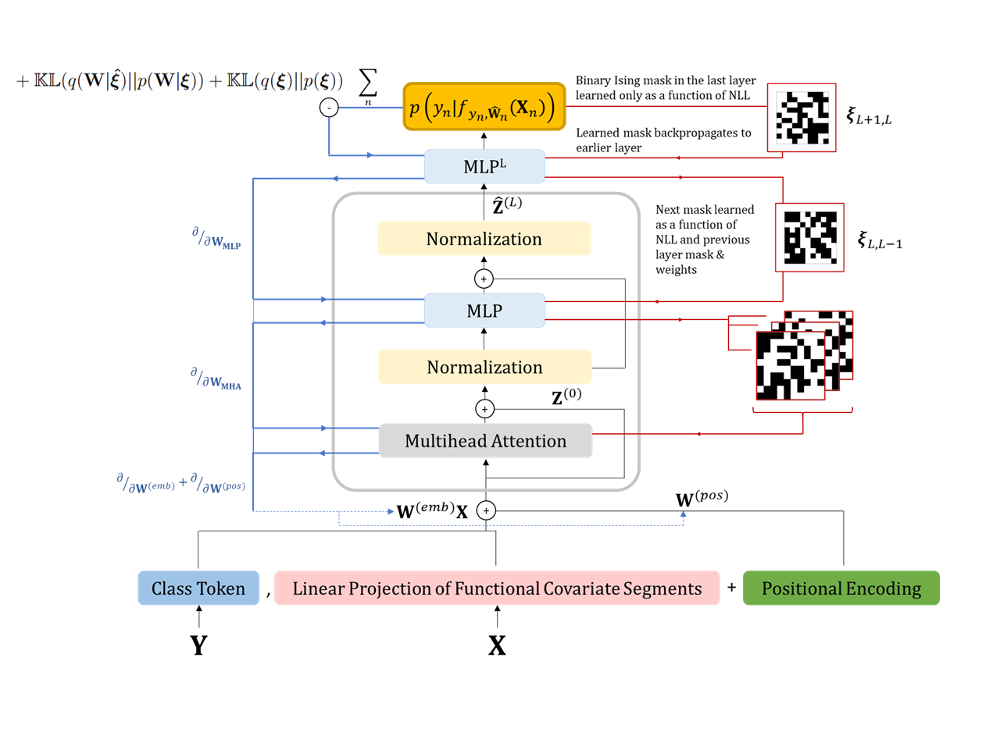

# Likelihood-Guided Regularization in Attention-Based Models

A PyTorch implementation of **likelihood-guided variational Ising regularization** for Vision
Transformers (ViTs). The method learns *task-adaptive*, per-weight dropout probabilities directly
from the likelihood instead of fixing them by hand, and in doing so yields (i) structured sparsity /
pruning, (ii) a posterior over network connections, and (iii) calibrated predictive uncertainty — at
no extra cost beyond ordinary backpropagation.

This repository accompanies the paper *"Likelihood-guided Regularization in Attention-Based Models"*
(Salem & Kim). It reproduces every experiment in the paper on MNIST, Fashion-MNIST, CIFAR-10, and
CIFAR-100.

<p align="center">
  
  <br>
  <b>Figure 1.</b> Two-stage attention with layer-to-layer backpropagation of the Ising dropout
  masks. Masks are learned from the likelihood at the final layer, then propagated backward through
  the network according to inter-layer connectivity strength.
</p>

---

## The idea in one paragraph

Standard dropout / DropConnect zero out weights with a *fixed* probability. We instead treat each
weight's keep/drop indicator as a **binary selection variable** $\xi_{j',j}\in\{0,1\}$ with its own
posterior, and place a **spike-and-slab prior** on the weight conditioned on that indicator. The
selection posterior is written as an **Ising model** whose external field is the weight's *saliency*
— how much the training loss changes when that weight is removed. Weights that don't matter get
dropped; weights that do get kept. Because the saliency term is exactly the Optimal-Brain-Damage /
Levenberg–Marquardt Hessian approximation, it falls out of the normal backward pass for free.

---

## Method / math

Notation: $\mathbf{W}$ = all layer weights, $\boldsymbol{\xi}$ = per-weight binary selection mask,
$\mathcal D=\{y_n,\mathbf X_n\}_{n=1}^N$ = data.

### 1. Spike-and-slab prior, indexed by the selection mask

Each weight is drawn from one of two Gaussians depending on its selection variable:

$$
p(\mathbf W \mid \boldsymbol\xi) \;=\; \prod_{j,j'}
\xi_{j,j'}\,\mathcal N(\mathbf W; 0,\sigma_1^2) \;+\;
(1-\xi_{j,j'})\,\mathcal N(\mathbf W; 0,\sigma_2^2), \qquad \sigma_1^2 < \sigma_2^2 .
$$

The **spike** ($\sigma_1^2$) pins dropped weights near zero; the **slab** ($\sigma_2^2$) lets kept
weights move freely. Unlike a single global mixing weight $\pi$, here $\xi_{j,j'}$ is *per weight*.

> **Code:** `transformer_layers/bbb_linear.py :: BBBLinear`. The variational mean is `mean_weight`
> ($\mathbf M$ in the paper); `log_std_weight` is frozen at $\log\sigma \approx -4$. `forward()`
> samples the slab (`noisy_mean`) vs. spike (`sampled_weights`) according to the mask.

### 2. Variational objective (ELBO)

We approximate the intractable joint posterior $p(\mathbf W,\boldsymbol\xi\mid\mathbf X,\mathbf y)$
with $q(\mathbf W\mid\boldsymbol\xi)\,q(\boldsymbol\xi)$ and maximize the ELBO. After a one-sample
Monte-Carlo estimate of both integrals, the training objective is

$$
\min_{q}\; -\sum_{n}\log p\!\left(y_n \mid \mathbf X_n,\widehat{\mathbf W},\widehat{\boldsymbol\xi}\right)
\;+\;\mathbb{KL}\!\big(q(\mathbf W\mid\widehat{\boldsymbol\xi})\,\|\,p(\mathbf W\mid\boldsymbol\xi)\big)
\;+\;\mathbb{KL}\!\big(q(\boldsymbol\xi)\,\|\,p(\boldsymbol\xi)\big).
$$

The first term is ordinary cross-entropy on a masked forward pass; the KL on weights is folded into
weight decay (`kl_pen`); the KL on $\boldsymbol\xi$ is what the Ising posterior below optimizes.

> **Code:** the CE + penalty terms live in `VisionTransformerTrainer._select_criterion`; `kl_pen`
> is passed as Adam `weight_decay` in `_select_optimizer`.

### 3. The backward Ising posterior for the masks

The selection posterior for the weight connecting node $j$ (layer $l$) to node $j'$ (layer $l{+}1$)
is a logistic (Ising) form:

$$
q\!\left(\xi^{(l)}_{j',j}=1\right)=
\left[1+\exp\!\left\{-2\,\frac{\sum_{j''}w_{j'',j'}^2\,\mathbb E_q[\xi^{(l+1)}_{j'',j'}]}{\sum_{j''}w_{j'',j'}^2}
\;-\;\big(L_j^{+}-L_j^{-}\big)\;-\;\log\tfrac{\delta}{1-\delta}\right\}\right]^{-1}.
$$

Two forces set each mask probability:

- **Coupling term** (the ratio of squared outgoing weights weighted by the *next* layer's expected
  masks): a weight is more likely kept if it feeds into kept downstream units. This is the "Ising"
  interaction and is what makes the scheme **backward-looking** — a departure from prior forward
  Ising-dropout work.
- **External field** $L_j^{+}-L_j^{-}$: the change in log-likelihood from keeping vs. dropping the
  weight (its *saliency*), plus a tunable field $\delta$ (`dropconnect_delta`) that biases the
  baseline keep rate. $\delta=0.5$ is unbiased; $\delta=0.1$ gives a $\approx 0.9$ keep probability.

> **Code:** the final-layer probabilities are computed in closed form by
> `fast_compute_weight_dropout` (fully vectorized over all weights and MC mask samples). The
> backward propagation of masks to earlier layers — including the Q/K/V attention-triplet
> aggregation — is the reversed `named_parameters()` walk inside `train()` (`L_minus_1_connec`).

### 4. Saliency without extra passes (OBD / Levenberg–Marquardt)

Evaluating $L_j^{+}-L_j^{-}$ exactly needs $2^{|\boldsymbol\xi|}$ forward passes. Instead we
Taylor-expand the loss around the current optimum (Optimal Brain Damage):

$$
L_j^{+}-L_j^{-}\;\approx\;\tfrac{\partial^2 L}{\partial w_{j',j}^2}\;=\;\tfrac{\partial^2 L}{\partial a_{j'}^2}\,x_j^2,
$$

and propagate the Hessian diagonal with the **Levenberg–Marquardt** recursion, which drops all
$f''(\cdot)$ terms so the saliency comes along with normal backprop at no additional cost.

> **Code:** three selectable estimators via `ising_type`:
> | `ising_type` | External field source |
> |---|---|
> | `LM_saliency_scores` | Levenberg–Marquardt backprop approximation (paper default, cheapest) |
> | `diag_saliency_scores` | exact Hessian diagonal via batched HVPs (`exact_hessian_diag`) |
> | `no_saliency_scores` | Ising coupling only, saliency set to 0 (ablation) |

### 5. Three-phase training schedule

| Phase | Epochs (arg) | What happens |
|---|---|---|
| **pilot** | `train_epochs` | Standard training with $\boldsymbol\xi=\mathbf 1$; learns the variational means $\mathbf M$. |
| **ising** | `ising_epochs` | Each step: compute saliency, sample masks from the Ising posterior, apply them, backprop. |
| **fine-tuning** | `addtl_ft` | Freeze the averaged/thresholded mask, restore ordinary dropout, fine-tune. |

The averaged mask is thresholded at `drop_thresh` (default 0.5) to produce the final hard-pruned
model, and the number of expected/hard-dropped parameters is logged.

### 6. Prediction & uncertainty

MAP prediction and credible intervals come from $T$ stochastic forward passes:

$$
\hat y \approx \tfrac1T\sum_{t=1}^{T} f_{\widehat{\mathbf W}_t,\widehat{\boldsymbol\xi}_t}(\mathbf X),
$$

with predictive uncertainty read off as quantiles of the $T$ passes.

> **Code:** `predict_mc_posterior_weight_sampling_quantiles` (MC weight + mask resampling,
> per-class mean/quantiles, predictive entropy); `predict_with_probs` for the deterministic
> softmax; `evaluate` for point accuracy.

---

## Repository structure

```
Likelihood-guided-regularization-for-transformers/
├── transformer_layers/            # Model building blocks
│   ├── bbb_linear.py              #   BBBLinear: spike-and-slab variational linear layer;
│   │                             #   the atom every model below is built from
│   ├── bbb_ViT.py                 #   ViT assembled from BBBLinear (attention, encoder, full model)
│   ├── attention_pooling.py       #   DEPRECATED — attention-pooling head, unused by the current
│   │                             #   ViT; retained for reuse, warns on instantiation
│   └── sin_embeddings.py          #   DEPRECATED — sinusoidal positional embeddings, unused (the
│                                 #   ViT learns its patch embedding instead); warns on call
│
├── main/
│   └── VisionTransformer_Trainer.py   # The trainer: saliency, Ising mask backprop,
│                                      #   3-phase schedule, MC-posterior prediction
│                                      #   (one file — these pieces change as a unit)
│
├── data_loader/
│   ├── dataloader_master.py       # get_vit_dataloaders: seeded train/val/test splits;
│   │                             #   called by the trainer's _get_data / _get_data_ising
│   ├── mnist_fmnist_downloader.py # One-shot MNIST/Fashion-MNIST download; run once (or auto-run
│   │                             #   by the canonical runner's ensure_data) before training
│   ├── cifar_downloader.py        # One-shot CIFAR-10/100 download; same usage as above
│   └── tinyimage_downloader.py    # One-shot Tiny-ImageNet download; optional, larger benchmark
│
├── utils/                         # Helpers consumed by the trainer / analysis
│   ├── early_stopping.py          #   EarlyStopping — used in train() to checkpoint per phase and
│   │                             #   halt the pilot/fine-tune phases (kept always-on during ising)
│   ├── learning_rate.py           #   adjust_learning_rate — called at each epoch end in train()
│   │                             #   to apply the chosen step schedule (lradj type1..type7)
│   ├── metrics.py                 #   ACCRCY/LGLOSS/metric — used by _calc_accuracy, evaluate, and
│   │                             #   radar_plots to score predictions
│   └── preprocessing.py           #   DEPRECATED — StandardScaler + arg/string helpers, unused by
│                                 #   the ViT pipeline; retained for reuse, warns on use
│
├── examples/
│   ├── bulk_experiments_canonical.py  # ⭐ Canonical sweep runner — edit its CONFIG block and run;
│   │                                 #   the entry point for reproducing every experiment
│   ├── experiment_evaluation.py       # Post-hoc: macro metrics + calibration/entropy from the
│   │                                 #   prediction CSVs a sweep produces
│   ├── radar_plots_v2.py              # Renders the per-dataset radar charts in the paper
│   ├── sample_visualization_v2.py     # Renders the dataset sample grids (Figs. S1–S4)
│   └── analysis_results/              # Generated figures & aggregate CSVs
│
├── archive/                       # Frozen for provenance — superseded, not maintained
│   ├── pVisionTransformer_Trainer.py  #   Pre-canonical "pilot" trainer
│   ├── bulk_experiments*.py           #   Pre-canonical sweep-script family
│   ├── radar_plots.py                 #   v1 of the kept radar_plots_v2.py
│   ├── sample_visualiztion.py         #   v1 of the kept sample_visualiztion_v2.py
│   └── example_notebook*.ipynb        #   Early exploratory notebooks
│
├── pic/LBRT.png                   # Architecture figure (used at the top of this README)
├── requirements.txt
└── README.md
```

---

## Environment

```
Python  >= 3.9
torch   >= 1.11        # exact-Hessian path uses torch.autograd.grad(is_grads_batched=True)
torchvision
numpy, pandas, scipy, scikit-learn, matplotlib, tqdm
```

Install:

```bash
pip install -r requirements.txt
```

> **Note:** the trainer disables TF32 (`allow_tf32 = False`) so results are bit-comparable across
> GPU generations and against a CPU reference. Leave this on when reproducing paper numbers.

---

## Data

Datasets are downloaded once into per-dataset folders at the repo root
(`./mnist`, `./fashionmnist`, `./cifar10`, `./cifar100`). The canonical runner calls the right
downloader automatically the first time (`ensure_data`), or you can pre-fetch manually:

```bash
python data_loader/mnist_fmnist_downloader.py
python data_loader/cifar_downloader.py
```

---

## Reproducing the runs

All experiment settings live in a single **CONFIG block** at the top of
`examples/bulk_experiments_canonical.py` — edit there and nothing else, then run the file. There is
no command-line interface by design: the CONFIG block *is* the experiment record.

```bash
python examples/bulk_experiments_canonical.py
```

Each `(dataset, ising_type, val_split, seed)` cell appends one row to
`bulk_results_<TAG>.csv`. Checkpoints are seed-scoped under `./checkpoints_<TAG>/…`, so seeds never
overwrite or cross-load each other. The runner also records wall-clock time and peak/residual GPU
memory, and aborts the sweep if residual memory leaks past a threshold.

Key CONFIG knobs:

| Knob | Meaning |
|---|---|
| `DATASETS` | any of `mnist`, `fashionmnist`, `cifar10`, `cifar100` |
| `ISING_TYPES` | `LM_saliency_scores` \| `diag_saliency_scores` \| `no_saliency_scores` |
| `VAL_SPLITS` | validation fraction of the full dataset (controls train-set size) |
| `RUNS_PER_CFG` | number of seeds (0 … N−1) |
| `TRAIN_EPOCHS` / `ISING_EPOCHS` / `ADDTL_FT` | length of the pilot / ising / fine-tune phases |
| `DROPCONN` | external field $\delta$ (`dropconnect_delta`) |
| `DROPOUT` / `P_BAYES` | baseline dropout / Bayesian-layer drop probability (for baselines) |
| `SPLIT_SEED_FOLLOWS_RUN` | `True`: data partition varies per seed; `False`: fixed 42 |

Per-dataset model geometry (patch size, embed dim, heads, depth) is set in `MODEL_CFG`.

### Baselines

The paper compares the Ising regularizer against Bayesian ViTs with fixed **dropout** and fixed
**DropConnect**. Reproduce those by setting `ISING_EPOCHS = 0` and using `DROPOUT` (node dropout) or
`P_BAYES` (weight dropout in `BBBLinear`) respectively.

---

## Output schema

Each row of `bulk_results_<TAG>.csv` contains (per model):

- **Splits:** `dataset`, `train_samples`, `val_samples`, `test_samples`, `val_split`, `split_seed`
- **Losses:** `train_error`, `val_error`, `test_error` (final-epoch CE)
- **Accuracy:** `train_acc`, `val_acc`, `test_acc`, `final_test_accuracy` (+ `*_err` = 100 − acc)
- **Sparsity:** `num_parameters`, `ising_expected_dropped`, `ising_dropped`, `total_potential`
- **Budget:** `elapsed_sec`, `peak_gpu_gib`, `resid_gpu_gib`, `resid_gpu_gib_after_gc`

---

## Analysis & figures

After a sweep, generate the paper's calibration curves, entropy distributions, and radar plots:

```bash
python examples/experiment_evaluation.py   # metrics + calibration/entropy (set ckpt_root inside)
python examples/radar_plots_v2.py          # per-dataset radar charts
```

Outputs land in `examples/analysis_results/`. Calibration is read from the MC-posterior prediction
CSVs (`mc_prob_mean_*`, `mc_pred_entropy`); accuracy/precision/recall/F1/FPR are macro-averaged
one-vs-all, matching the paper's tables.

---

## Citing

```bibtex
@article{salem_kim_ising_vit,
  title   = {Likelihood-guided Regularization in Attention-Based Models},
  author  = {Salem, Mohamed and Kim, Inyoung},
  note    = {Department of Statistics, Virginia Tech}
}
```

## Acknowledgements

The approach is architecture-agnostic and has also been validated on the Crossformer
(Zhang & Yan, ICLR 2023). We thank the authors of Crossformer, Informer, Autoformer, Pyraformer, and
FEDformer for their open-source code utilities.
